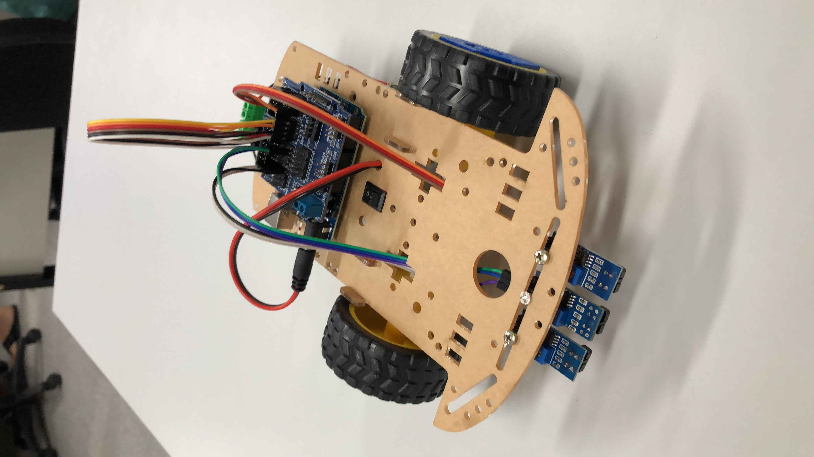

<h1>Experimentação Orientada</h1>

Nessa disciplina recebemos alguns carrinhos montados a partir de um Arduino Uno e alguns sensores. Desenvolvi 3 projetos simples: um carrinho controlado por bluetooth, um carrinho que desvia de obstáculos e um carrinho seguidor de linha.

Ao final da disciplina ainda reutilizei o seguidor de linha na competição do Dia T (evento promovido pelo CCT da Unifor). Nossa equipe ficou em 4o lugar.

